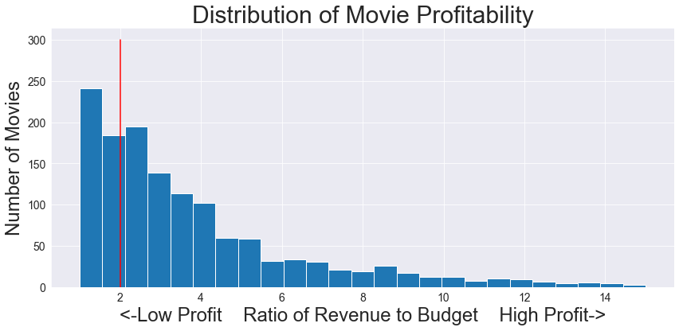
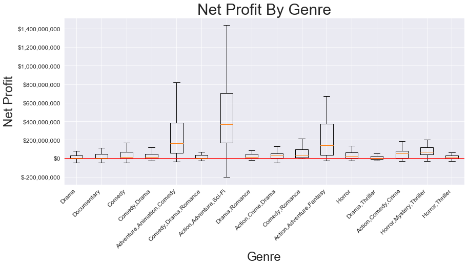

# Risky Business:
#### An Exploration of Risk in the Movie Industry

## Authors: Griffin Hundley and Eon Slemp

### Overview
#### The movie industry generates about 40 billion dollars of revenue annually.  That number is expected to continue to grow over the next several years.  The hazards of this market are many.  Analysis of the profitability of movie shows a distribution that is highly skewed in the direction of financial loss.  This work seeks to reduce risk for a potential entrant to this industry



### Business Problem
#### Microsoft is considering an entry to this industry.  There is wide variation in expected financial return depending on the genre of movie.  To reduce the potential danger with such a move, Microsoft needs an exploratory analysis of profitabilty as it relates to movie genre. Different movie genres offer very different financial oportunities.  Some genres offer the ability to multiply a a small initial investment, but an actor with deeper pockets can gamble big and win big in other genres.  Film production in these different genre categories are very different fincancial and creative projects.  

### Data
#### The data used for this analysis come from two data sets.  A data set from the 'The Numbers' website provides financial data relating to the world wide gross and production budget of the film.  And a data set from 'imbd' provides detailed genre information.  These two data sets are merged with a bias towards movies produced in the last twenty years to give a better feel for contemporary taste in cinema.  



### Methods
####  This analysis gives insight into expected return across 16 pure and hybrid genre categories.  Some offer high investment with the potential for huge profit.  Others offer more modest profit for lower investment.  We identify the mean expected revenue and interquartile range of return in these genres as a multiple of production budget. we also look at revenue totals across these genre categories. These two views of the movie business reveal the differing nature of operating in different genre categories.  

### Results
#### The genre that offers the most potential for revenue is clearly is clearly the science fiction/action, adventure/comedy, and adventure/fantasy categories.  These Genres also cost the most to invest in.  The genre with the most potential to multiply a small investment is horror/mystery thriller.  These films are cheap to produce, but if they find an audience can multiply initial investment several times over.  Pure drama, comedy, or romance offer a safer bet, but less potential for huge gain. 

## Conclusions
#### based on the revealed highly skewed nature of profit in the movie business an entrant needs to tread carefully.  The benefits of a movie studio can transcend, in difficult to quantify ways, considerations of mere financial gain.  Cinema is a cultural force that can shape attitudes of millions of people.  Furthermore cinema offers merchandising opportunities for items related to a popular film.  These returns can dwarf the box office returns of a film.  These considerations are not treated here. 
### The decision maker must select the genre of film he wishes to produce with risk in mind.
#### How much loss can a studio sustain?  This decision will determine the size of the budget and necessariliy the genre.  We identify three main paths forward:  1.  Highly risky science fiction and action productions that offer huge upside.  2.  Less risky romance or comedy movies that can reliably generate modest returns, or 3.  Low investment but potential huge returns on a movie in the horror/thriller genre.  
### An executive must seek service from talented artists, and producers to maximize odds for success. 
#### A talent recruitment/development program can identify young, capable artists before they will be able to command huge salaries can reduce initial investment and increase the odds of a highly profitable movie. 

## Next Steps:
#### In the future it might be usefull to do analyses on traits of highly succesfull directors.  The director is the principal creative agent of a film.  Carefully selecting skilled directors is the most important personell decision that a studio makes.  This analysis deserves special time and attention.  


## For More Information

## Please review our full analysis in [our Jupyter Notebook](FinalNotebook.ipynb) 


## For any additional questions, please contact Griffin Hundley at hundlegq@dukes.jmu.edu or Eon Slemp at eonslemp@gmail.com

## Repository Structure

```
├── README.md                           <- The top-level README for reviewers of this project
├── FinalNotebook.ipynb   <- Narrative documentation of analysis in Jupyter notebook
├── FInalNotebook.pdf         <- PDF version of project presentation
├── data                                <- Both sourced externally and generated from code
└── images                              <- Both sourced externally and generated from code
```

